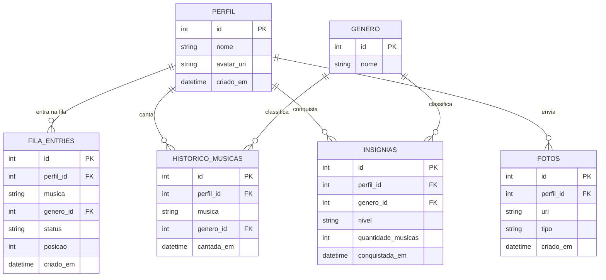

# Julius Fila — App Mobile

Aplicativo mobile (Android/iOS, via Expo) para gerenciar a fila de karaokê do Julius. Complementa o painel web existente, focado na experiência do cliente: entrar na fila, acompanhar a posição e colecionar insígnias pelas músicas cantadas.

## Sobre o app

O app permite que o cliente entre na fila do karaokê pelo celular, acompanhe sua posição em tempo real e ganhe insígnias conforme canta músicas de diferentes gêneros (ex: 5 músicas de rock = insígnia de bronze, 10 = prata). Opcionalmente, permite subir uma foto do momento no palco.

**Funcionalidades básicas (prioritárias):**

- [ ] Cadastro/identificação simples do cliente (nome, sem senha)
- [ ] Entrar na fila informando música e gênero
- [ ] Ver posição atual na fila
- [ ] Ver status da música (aguardando / tocando / concluída)
- [ ] Histórico de músicas já cantadas pelo cliente
- [ ] Cálculo e exibição de insígnias por gênero (baseado na quantidade de músicas cantadas)

**Funcionalidades adicionais (trabalhos futuros):**

- [ ] Upload de foto do momento no palco (vinculada ao perfil ou à música)
- [ ] Compartilhar insígnia conquistada (imagem/redes sociais)
- [ ] Notificação local quando a vez estiver próxima
- [ ] Sincronização remota da fila (hoje é local por dispositivo)
- [ ] Ranking de clientes por insígnias

## Protótipos de tela

Protótipo no Figma (mapa de telas): **[Julius Fila - Protótipos](https://www.figma.com/design/gi5gQYkMtRoWRHfHBSqeVc?node-id=2-10)**

> ⚠️ Link só abre pra quem tem acesso ainda. Falta habilitar "Anyone with the link" (Share → Anyone with the link → Can view) no arquivo antes de entregar.

Telas: Home, Entrar na Fila, Minha Fila (posição/status em tempo real), Perfil com Insígnias por gênero, Upload de Foto (opcional).

## Modelagem do banco

Banco **local**, no próprio dispositivo, via **SQLite** (`expo-sqlite`). Não há backend remoto nesta fase do MVP — cada instalação do app mantém sua própria fila e histórico. Sincronização entre dispositivos fica como trabalho futuro (ver checklist acima).

Diagrama entidade-relacionamento:

## Planejamento de sprints

| Sprint | Semanas | Entregas |
|---|---|---|
| 1 | 1–2 | Setup do projeto Expo, navegação entre telas, protótipo de telas no Figma, modelagem do banco (este checkpoint) |
| 2 | 3–4 | Telas estáticas (Home, Entrar na Fila, Minha Fila, Perfil) com dados mockados |
| 3 | 5–6 | Integração com SQLite local: criação do schema, CRUD de perfil e fila |
| 4 | 7–8 | Lógica de fila (entrar/sair, cálculo de posição, atualização de status) |
| 5 | 9–10 | Sistema de insígnias: histórico de músicas por gênero, cálculo de níveis, tela de conquistas |
| 6 | 11–12 | Upload de foto (expo-image-picker), polimento de UI, testes manuais e ajustes finais |
