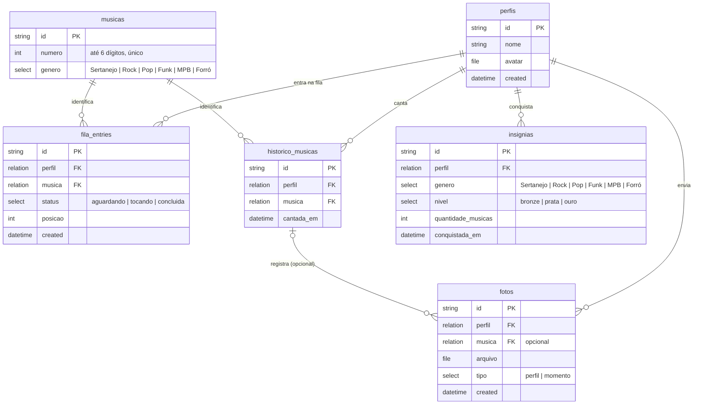

# Julius Fila — App Mobile

Aplicativo mobile (Android/iOS, via Expo) para gerenciar a fila de karaokê do Julius. Complementa o painel web existente, focado na experiência do cliente: entrar na fila, acompanhar a posição e colecionar insígnias pelas músicas cantadas.

## Sobre o app

O app permite que o cliente entre na fila do karaokê pelo celular, acompanhe sua posição em tempo real e ganhe insígnias conforme canta músicas de diferentes gêneros (ex: 5 músicas de rock = insígnia de bronze, 10 = prata). Opcionalmente, permite subir uma foto do momento no palco.

**Funcionalidades básicas (prioritárias):**

- [ ] Cadastro/identificação simples do cliente (nome, sem senha)
- [ ] Entrar na fila informando o número da música (até 6 dígitos) — gênero é resolvido automaticamente pelo catálogo no banco, não é escolhido manualmente
- [ ] Ver posição atual na fila
- [ ] Ver status da música (aguardando / tocando / concluída)
- [ ] Histórico de músicas já cantadas pelo cliente
- [ ] Cálculo e exibição de insígnias por gênero (baseado na quantidade de músicas cantadas)

**Funcionalidades adicionais (trabalhos futuros):**

- [ ] Upload de foto do momento no palco (vinculada ao perfil ou à música)
- [ ] Compartilhar insígnia conquistada (imagem/redes sociais)
- [ ] Notificação local quando a vez estiver próxima
- [ ] Ranking de clientes por insígnias

## Protótipos de tela

Protótipo no Figma (mapa de telas): **[Julius Fila - Protótipos](https://www.figma.com/design/gi5gQYkMtRoWRHfHBSqeVc?node-id=2-10)**

> ⚠️ Link só abre pra quem tem acesso ainda. Falta habilitar "Anyone with the link" (Share → Anyone with the link → Can view) no arquivo antes de entregar.

Telas: Home, Entrar na Fila, Minha Fila (posição/status em tempo real), Perfil com Insígnias por gênero, Upload de Foto (opcional).

## Modelagem do banco

Banco **remoto**, via **[PocketBase](https://pocketbase.io/)** (self-hosted, escrito em Go, SQLite por baixo). App consome REST + realtime pelo SDK oficial (`pocketbase` no npm). Troca a versão 100% local por fila de verdade compartilhada entre aparelhos, e ganha storage de arquivo nativo pro upload de foto — sem precisar gerenciar URI de imagem no dispositivo.

Música não é texto livre: o cliente informa apenas um **número de catálogo (até 6 dígitos)**. O gênero não é escolhido por quem entra na fila — vem fixo no cadastro da música (campo `select` na própria collection `musicas`), resolvido automaticamente a partir do número informado.

Cada entidade abaixo é uma **collection** no PocketBase. Diferenças de plataforma em relação a um schema SQL tradicional:

- `id` é string (15 caracteres, gerado automaticamente) — não int autoincrement. Toda relation aponta para esse `id`, nunca para um campo de negócio.
- Por isso `musicas.numero` deixa de ser PK: vira campo comum com índice único, e `id` (interno) assume o papel de chave.
- `created` / `updated` são automáticos em toda collection — dispensam os `criado_em` manuais do desenho anterior.
- Campos que eram `FK int` viram campo tipo **relation**.
- `genero`, `status`, `nivel` e `tipo` (valores fixos e pequenos) viram campo tipo **select** — equivalente do CHECK-enum, editável pela UI do PocketBase sem migração. Gênero não tem collection própria: é select fixo direto em `musicas` (e repetido em `insignias`, já que ali é um resumo por perfil+gênero, não uma referência a registro).
- `fotos` usa campo tipo **file** nativo (upload direto, sem lógica de persistência local).

Diagrama entidade-relacionamento (mesmo modelo lógico, agora como collections remotas):

## Planejamento de sprints

| Sprint | Semanas | Entregas                                                                                                        |
| ------ | ------- | --------------------------------------------------------------------------------------------------------------- |
| 1      | 1–2     | Setup do projeto Expo, navegação entre telas, protótipo de telas no Figma, modelagem do banco (este checkpoint) |
| 2      | 3–4     | Telas estáticas (Home, Entrar na Fila, Minha Fila, Perfil) com dados mockados                                   |
| 3      | 5–6     | Setup do PocketBase (self-host) + collections do modelo, integração via SDK: CRUD de perfil e fila              |
| 4      | 7–8     | Lógica de fila (entrar/sair, cálculo de posição, atualização de status)                                         |
| 5      | 9–10    | Sistema de insígnias: histórico de músicas por gênero, cálculo de níveis, tela de conquistas                    |
| 6      | 11–12   | Upload de foto (expo-image-picker), polimento de UI, testes manuais e ajustes finais                            |
